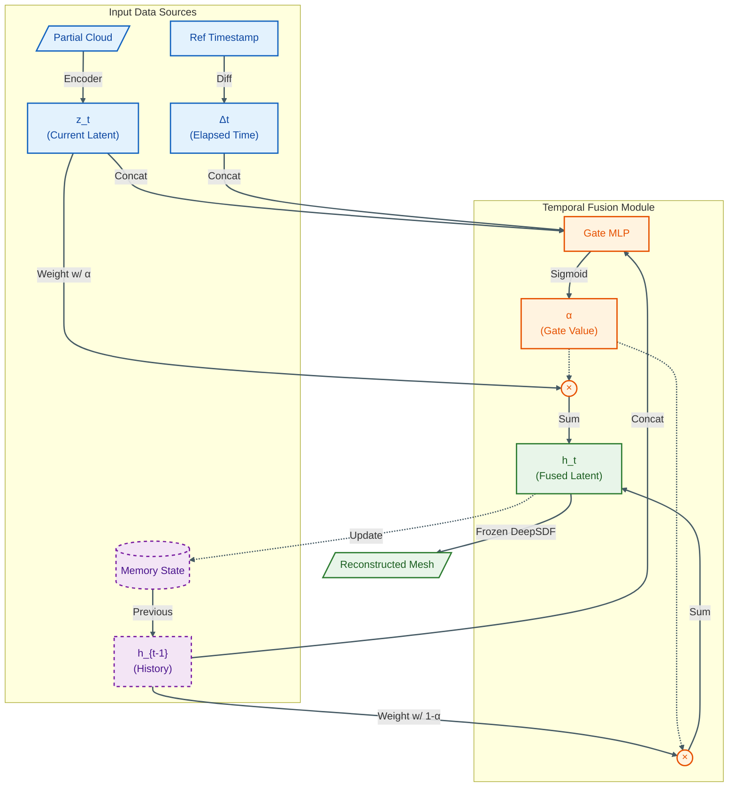

# Temporal CoRe++ Architecture

This diagram illustrates the data flow in the `TemporalFusionModule` during a single time step $t$.

<!-- [MermaidChart: c24b54cb-bc8e-4c56-bc4d-7f7cddb770e5] -->

```mermaid
graph TD
    %% Styling Definitions
    classDef data fill:#e3f2fd,stroke:#1565c0,stroke-width:2px,color:#0d47a1
    classDef proc fill:#fff3e0,stroke:#e65100,stroke-width:2px,color:#e65100
    classDef out fill:#e8f5e9,stroke:#2e7d32,stroke-width:2px,color:#1b5e20
    classDef mem fill:#f3e5f5,stroke:#7b1fa2,stroke-width:2px,stroke-dasharray: 5 5,color:#4a148c
    
    subgraph Inputs ["Input Data Sources"]
        direction TB
        P[/"Partial Cloud"/]:::data -->|Encoder| Z["z_t <br>(Current Latent)"]:::data
        M[("Memory State")]:::mem -->|Previous| H_prev["h_{t-1} <br>(History)"]:::mem
        T[Ref Timestamp]:::data -->|Diff| D["Δt <br>(Elapsed Time)"]:::data
    end

    subgraph Fusion ["Temporal Fusion Module"]
        direction TB
        Z & H_prev & D -->|Concat| MLP[Gate MLP]:::proc
        MLP -->|Sigmoid| Alpha["α <br>(Gate Value)"]:::proc
        
        Z -->|Weight w/ α| WZ(("×")):::proc
        H_prev -->|Weight w/ 1-α| WH(("×")):::proc
        
        Alpha -.-> WZ
        Alpha -.-> WH
        
        WZ & WH -->|Sum| H_new["h_t <br>(Fused Latent)"]:::out
    end

    H_new -->|Frozen DeepSDF| Mesh[/"Reconstructed Mesh"/]:::out
    H_new -.->|Update| M

    %% Link Styling
    linkStyle default stroke:#455a64,stroke-width:2px;
```
